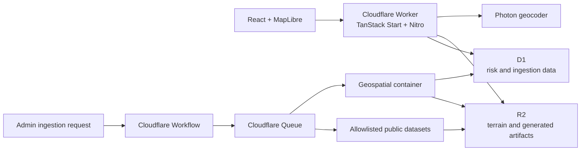

# Yaad Guard

Yaad Guard is an interactive Caribbean flood-risk explorer. It combines
terrain, storm history, storm-surge return levels, population, land cover, and
user-selected rainfall to produce deterministic regional risk summaries.

The application currently provides:

- Place search constrained to supported Caribbean map bounds.
- Selectable map grid cells and location-based risk summaries.
- Rainfall simulation with estimated surface-water depth.
- MapLibre 3D terrain and hillshade backed by generated DEM tiles.
- Historical storm, surge, terrain, population, and land-cover context.
- A Cloudflare-native ingestion pipeline for versioned source data.

> Yaad Guard is an informational planning tool, not an emergency warning
> system or a substitute for official forecasts and evacuation guidance.

## Architecture



Runtime insights are deterministic; the application does not call an LLM to
generate risk scores or advisories.

## Data Sources

| ID     | Dataset               | Purpose                                           |
| ------ | --------------------- | ------------------------------------------------- |
| `T-01` | Copernicus DEM GLO-30 | Terrain summaries, elevation grids, and DEM tiles |
| `T-09` | ESA WorldCover        | Land-cover and water context                      |
| `H-01` | NOAA/NHC HURDAT2      | Historical Atlantic storm tracks                  |
| `H-12` | GTSM-ERA5-E           | Storm-surge and extreme sea-level return values   |
| `E-02` | WorldPop              | Population and exposure context                   |

Raw and generated artifacts are stored in R2. An active manifest at
`manifests/active.json` selects the generated dataset version used at runtime.

## Tech Stack

- TanStack Start, TanStack Router, React 19, and Vite
- MapLibre GL through `react-map-gl`
- Tailwind CSS
- Cloudflare Workers, D1, R2, Queues, Workflows, and Containers
- Drizzle ORM
- Vitest and Playwright

## Local Development

Requirements:

- Node.js and npm
- A Cloudflare account for remote data, deployment, or ingestion
- Docker when building or deploying the geospatial container

Install dependencies and start the local development server:

```bash
npm install
npm run db:migrate:local
npm run dev
```

Open [http://localhost:3000](http://localhost:3000).

Local development uses simulated D1 and R2 bindings. Queue, Workflow, and
Container processing are disabled locally by default.

### Use Remote Cloudflare Data

To run the local application against the configured production D1 database and
R2 bucket:

```bash
npx wrangler login
npm run dev:remote-data
```

This uses `wrangler.remote-data.jsonc`. It intentionally does not bind the
ingestion Queue, Workflow, or geospatial Container.

## Database

The D1 schema is defined with Drizzle under `db/schema` and migrations are
stored in `db/migrations`.

```bash
# Generate a migration after changing the schema
npm run db:generate

# Apply migrations
npm run db:migrate:local
npm run db:migrate:remote
```

## Ingestion

Ingestion is admin-only and accepts source IDs from the allowlist above.
Configure the production secret before calling the endpoints:

```bash
npx wrangler secret put INGESTION_ADMIN_TOKEN
```

Start a run:

```bash
curl -X POST https://<worker-host>/api/ingestion/start \
  -H "Authorization: Bearer <token>" \
  -H "Content-Type: application/json" \
  -d '{"sourceIds":["H-01","E-02"]}'
```

Omit `sourceIds` to enqueue every configured source. Check recent runs or one
specific run:

```bash
curl https://<worker-host>/api/ingestion/status \
  -H "Authorization: Bearer <token>"

curl "https://<worker-host>/api/ingestion/status?runId=<run-id>" \
  -H "Authorization: Bearer <token>"
```

The pipeline records run and job status in D1, stores raw inputs and generated
artifacts in R2, and publishes completed data through the active manifest.

## Commands

| Command                   | Description                          |
| ------------------------- | ------------------------------------ |
| `npm run dev`             | Start local development on port 3000 |
| `npm run dev:remote-data` | Start locally with remote D1 and R2  |
| `npm run build`           | Create a production build            |
| `npm run preview`         | Preview the production build         |
| `npm run deploy`          | Build and deploy with Wrangler       |
| `npm run cf:typegen`      | Regenerate Cloudflare binding types  |
| `npm run test:unit`       | Run unit tests                       |
| `npm run test:e2e`        | Run Playwright tests                 |
| `npm test`                | Run unit and end-to-end tests        |
| `npm run lint`            | Run ESLint                           |
| `npm run format`          | Check formatting                     |
| `npm run check`           | Apply Prettier and ESLint fixes      |

## Deployment

The Worker and its bindings are configured in `wrangler.jsonc`. Confirm the D1,
R2, Queue, Workflow, Durable Object, and Container resources exist in the
target Cloudflare account, then run:

```bash
npm run db:migrate:remote
npm run deploy
```

Wrangler builds the geospatial image from
`containers/geospatial/Dockerfile` during deployment.

## Project Layout

```text
src/features/map/       Map UI, risk analysis, terrain, and rain simulation
src/routes/             TanStack Router routes
server/api/             Nitro API routes
ingestion/              Source catalog and ingestion orchestration
containers/geospatial/  Python geospatial processing container
db/schema/              Drizzle D1 schema
db/migrations/          D1 migrations
docs/                   Architecture and implementation plans
```
