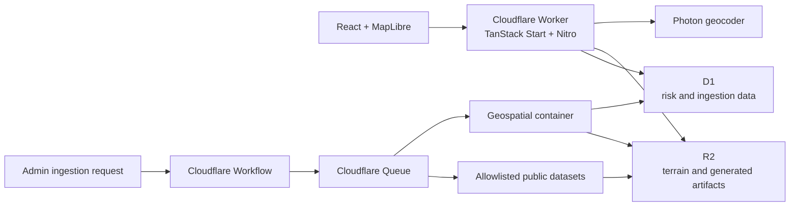

Welcome to your new TanStack Start app!

Yaad Guard is an interactive Caribbean flood-risk explorer. It combines
terrain, storm history, storm-surge return levels, population, land cover, and
user-selected rainfall to produce deterministic regional risk summaries.

The application currently provides:

- Place search constrained to supported Caribbean map bounds.
- Selectable map grid cells and location-based risk summaries.
- Rainfall simulation with estimated surface-water depth.
- MapLibre 3D terrain and hillshade backed by generated DEM tiles.
- Historical storm, surge, terrain, population, and land-cover context.
- A Cloudflare-native ingestion pipeline for versioned source data.

> Yaad Guard is an informational planning tool, not an emergency warning
> system or a substitute for official forecasts and evacuation guidance.

## Architecture



Runtime insights are deterministic; the application does not call an LLM to
generate risk scores or advisories.

## Data Sources

| ID     | Dataset               | Purpose                                           |
| ------ | --------------------- | ------------------------------------------------- |
| `T-01` | Copernicus DEM GLO-30 | Terrain summaries, elevation grids, and DEM tiles |
| `T-09` | ESA WorldCover        | Land-cover and water context                      |
| `H-01` | NOAA/NHC HURDAT2      | Historical Atlantic storm tracks                  |
| `H-12` | GTSM-ERA5-E           | Storm-surge and extreme sea-level return values   |
| `E-02` | WorldPop              | Population and exposure context                   |

Raw and generated artifacts are stored in R2. An active manifest at
`manifests/active.json` selects the generated dataset version used at runtime.

## Tech Stack

- TanStack Start, TanStack Router, React 19, and Vite
- MapLibre GL through `react-map-gl`
- Tailwind CSS
- Cloudflare Workers, D1, R2, Queues, Workflows, and Containers
- Drizzle ORM
- Vitest and Playwright

## Local Development

Requirements:

- Node.js and npm
- A Cloudflare account for remote data, deployment, or ingestion
- Docker when building or deploying the geospatial container

Install dependencies and start the local development server:

```bash
npm install
npm run db:migrate:local
npm run dev
```

Open [http://localhost:3000](http://localhost:3000).

Local development uses simulated D1 and R2 bindings. Queue, Workflow, and
Container processing are disabled locally by default.

### Use Remote Cloudflare Data

To run the local application against the configured production D1 database and
R2 bucket:

```bash
npx wrangler login
npm run dev:remote-data
```

This uses remote bindings for `DB` and `YAAD_GUARD_BUCKET` from
`wrangler.remote-data.jsonc`. It does not bind the ingestion queue or workflow.

## Caribbean Terrain Artifacts

Production terrain and elevation are generated offline from data under
`/Volumes/Games/InitToWinit26-terrain`. The Worker only reads uploaded R2
artifacts; it does not run GDAL, Python, or request-time raster processing.

Download and validate the Copernicus DEM GLO-30 source:

```bash
npm run terrain:download-copernicus
npm run terrain:validate-source
```

The downloader covers `[-90, 9, -58, 33]`, including the Caribbean islands,
Belize, The Bahamas, Turks and Caicos, and Bermuda. It writes only to
`sources/copernicus-dem-glo-30`; the existing GEDTM30 files are not used.

Generate a Copernicus Terrain-RGB PNG release. Start with the Jamaica smoke
test, then run the full Caribbean build:

```bash
npm run terrain:generate -- --smoke-test \
  --output=/Volumes/Games/InitToWinit26-terrain/generated/copernicus-smoke

npm run terrain:generate -- \
  --output=/Volumes/Games/InitToWinit26-terrain/generated/copernicus-glo30-caribbean
```

The full zoom 10-13 build is intentionally explicit because it can take hours
and produce many thousands of files. Convert the generated PNG release to
lossless WebP, preview it locally, then publish it:

```bash
npm run terrain:prepare-webp -- \
  /Volumes/Games/InitToWinit26-terrain/generated/copernicus-glo30-caribbean \
  /Volumes/Games/InitToWinit26-terrain/generated/copernicus-glo30-caribbean-webp

npm run terrain:preview-local -- \
  /Volumes/Games/InitToWinit26-terrain/generated/copernicus-glo30-caribbean-webp

npm run dev:local-terrain

npm run terrain:publish -- \
  /Volumes/Games/InitToWinit26-terrain/generated/copernicus-glo30-caribbean-webp
```

The release directory must contain `tiles/{z}/{x}/{y}.webp` and
`elevation-grids/**/*.json`; `terrain-summaries/**/*.json` is optional. WebP
tiles are lossless because Terrain-RGB channel values encode elevation.
`terrain:preview-local` serves the release from `http://localhost:4174` so the
app can be checked visually before anything is uploaded. Publishing uploads
directly to the flat R2 `data/` prefix and temporarily excludes `tiles/13/**`
until z13 is ready. Publishing is rejected unless
`provenance/source-manifest.json` identifies Copernicus DEM GLO-30 (`T-01`).

## Database

The D1 schema is defined with Drizzle under `db/schema` and migrations are
stored in `db/migrations`.

```bash
# Generate a migration after changing the schema
npm run db:generate

# Apply migrations
npm run db:migrate:local
npm run db:migrate:remote
```

## Ingestion

Ingestion is admin-only and accepts source IDs from the allowlist above.
Configure the production secret before calling the endpoints:

```bash
npx wrangler secret put INGESTION_ADMIN_TOKEN
```

## Styling

This project uses [Tailwind CSS](https://tailwindcss.com/) for styling.

### Removing Tailwind CSS

If you prefer not to use Tailwind CSS:

1. Remove the demo pages in `src/routes/demo/`
2. Replace the Tailwind import in `src/styles.css` with your own styles
3. Remove `tailwindcss()` from the plugins array in `vite.config.ts`
4. Uninstall the packages: `npm install @tailwindcss/vite tailwindcss -D`

## Linting & Formatting

This project uses [eslint](https://eslint.org/) and [prettier](https://prettier.io/) for linting and formatting. Eslint is configured using [tanstack/eslint-config](https://tanstack.com/config/latest/docs/eslint). The following scripts are available:

```bash
curl -X POST https://<worker-host>/api/ingestion/start \
  -H "Authorization: Bearer <token>" \
  -H "Content-Type: application/json" \
  -d '{"sourceIds":["H-01","E-02"]}'
```

## Routing

This project uses [TanStack Router](https://tanstack.com/router) with file-based routing. Routes are managed as files in `src/routes`.

### Adding A Route

To add a new route to your application just add a new file in the `./src/routes` directory.

TanStack will automatically generate the content of the route file for you.

Now that you have two routes you can use a `Link` component to navigate between them.

### Adding Links

To use SPA (Single Page Application) navigation you will need to import the `Link` component from `@tanstack/react-router`.

```tsx
import { Link } from '@tanstack/react-router'
```

The pipeline records run and job status in D1, stores raw inputs and generated
artifacts in R2, and publishes completed data through the active manifest.

## Commands

| Command                   | Description                          |
| ------------------------- | ------------------------------------ |
| `npm run dev`             | Start local development on port 3000 |
| `npm run dev:remote-data` | Start locally with remote D1 and R2  |
| `npm run build`           | Create a production build            |
| `npm run preview`         | Preview the production build         |
| `npm run deploy`          | Build and deploy with Wrangler       |
| `npm run cf:typegen`      | Regenerate Cloudflare binding types  |
| `npm run test:unit`       | Run unit tests                       |
| `npm run test:e2e`        | Run Playwright tests                 |
| `npm test`                | Run unit and end-to-end tests        |
| `npm run lint`            | Run ESLint                           |
| `npm run format`          | Check formatting                     |
| `npm run check`           | Apply Prettier and ESLint fixes      |

## Deployment

The Worker and its bindings are configured in `wrangler.jsonc`. Confirm the D1,
R2, Queue, Workflow, Durable Object, and Container resources exist in the
target Cloudflare account, then run:

```bash
npm run db:migrate:remote
npm run deploy
```

Wrangler builds the geospatial image from
`containers/geospatial/Dockerfile` during deployment.

## Project Layout

```text
src/features/map/       Map UI, risk analysis, terrain, and rain simulation
src/routes/             TanStack Router routes
server/api/             Nitro API routes
ingestion/              Source catalog and ingestion orchestration
containers/geospatial/  Python geospatial processing container
db/schema/              Drizzle D1 schema
db/migrations/          D1 migrations
docs/                   Architecture and implementation plans
```

More information on layouts can be found in the [Layouts documentation](https://tanstack.com/router/latest/docs/framework/react/guide/routing-concepts#layouts).

## Server Functions

TanStack Start provides server functions that allow you to write server-side code that seamlessly integrates with your client components.

```tsx
import { createServerFn } from '@tanstack/react-start'

const getServerTime = createServerFn({
  method: 'GET',
}).handler(async () => {
  return new Date().toISOString()
})

// Use in a component
function MyComponent() {
  const [time, setTime] = useState('')

  useEffect(() => {
    getServerTime().then(setTime)
  }, [])

  return <div>Server time: {time}</div>
}
```

## API Routes

You can create API routes by using the `server` property in your route definitions:

```tsx
import { createFileRoute } from '@tanstack/react-router'
import { json } from '@tanstack/react-start'

export const Route = createFileRoute('/api/hello')({
  server: {
    handlers: {
      GET: () => json({ message: 'Hello, World!' }),
    },
  },
})
```

## Data Fetching

There are multiple ways to fetch data in your application. You can use TanStack Query to fetch data from a server. But you can also use the `loader` functionality built into TanStack Router to load the data for a route before it's rendered.

For example:

```tsx
import { createFileRoute } from '@tanstack/react-router'

export const Route = createFileRoute('/people')({
  loader: async () => {
    const response = await fetch('https://swapi.dev/api/people')
    return response.json()
  },
  component: PeopleComponent,
})

function PeopleComponent() {
  const data = Route.useLoaderData()
  return (
    <ul>
      {data.results.map((person) => (
        <li key={person.name}>{person.name}</li>
      ))}
    </ul>
  )
}
```

Loaders simplify your data fetching logic dramatically. Check out more information in the [Loader documentation](https://tanstack.com/router/latest/docs/framework/react/guide/data-loading#loader-parameters).

# Demo files

Files prefixed with `demo` can be safely deleted. They are there to provide a starting point for you to play around with the features you've installed.

# Learn More

You can learn more about all of the offerings from TanStack in the [TanStack documentation](https://tanstack.com).

For TanStack Start specific documentation, visit [TanStack Start](https://tanstack.com/start).
