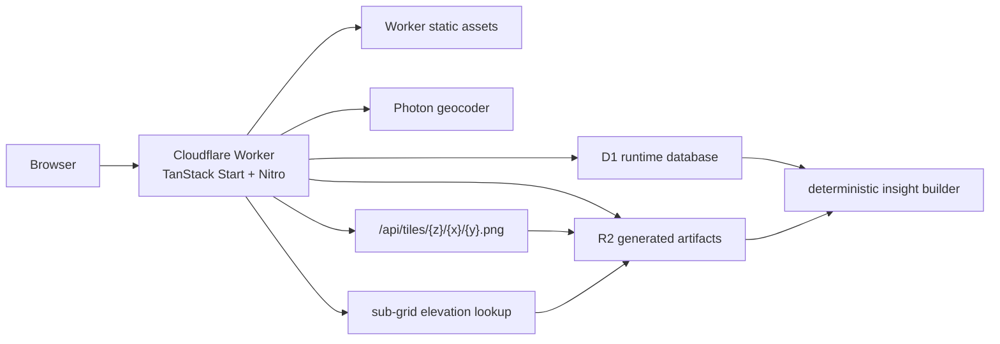
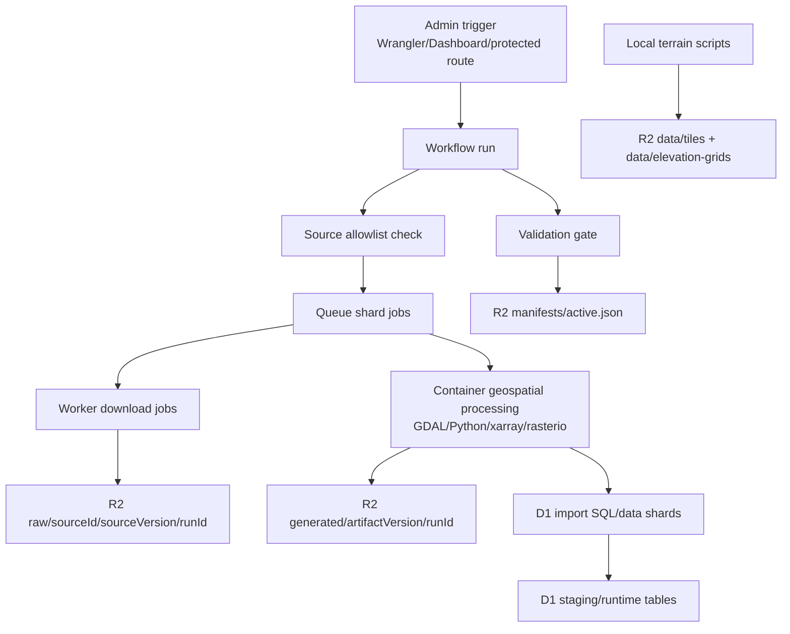

# Cloudflare Port Plan

## Goal

Port Yaad Guard from the current Railway/Node/PostgreSQL/S3-style runtime to a Cloudflare-native deployment while preserving the current non-chat product experience:

- Interactive TanStack Start map.
- Region insight sidebar with deterministic risk scoring and deterministic copy.
- Terrain popup and terrain PNG tile serving.
- Rain simulation using sub-grid elevation data.
- Winston remains as a non-interactive mascot and visual asset only.
- Scientific assets and runtime data are regenerated from defensible source datasets.

The port must not depend on the user's local machine for large downloads, uploads, or geospatial processing. Cloudflare-hosted ingestion jobs will fetch and process source data.

## Current Repo Findings

The current app is a TanStack Start/Vite app with Nitro server routes and Node-oriented server code.

Runtime dependencies to replace or remove:

- PostgreSQL: `db/client.ts` uses `pg`, `drizzle-orm/node-postgres`, and `DATABASE_URL`.
- PostgreSQL schema: `db/schema/*` uses `pg-core`, `bigserial`, `jsonb`, and PostgreSQL indexes.
- S3-compatible storage: tile and raster loaders use `@aws-sdk/client-s3`, `SOURCE_BUCKET`, `S3_ENDPOINT`, and AWS credentials.
- GeoTIFF request-time processing: `src/features/map/insightsData.server.ts` and `src/features/map/elevation.ts` can load full rasters into memory.
- LLM/chat: `/api/chat`, `WinstonChat`, `winston.server.ts`, `openrouter.server.ts`, and OpenRouter environment variables.
- Checked-in assets are incomplete for the target deployment; Winston/app icons should be regenerated.

## Decisions

- Target Cloudflare Workers with static assets, not Cloudflare Pages.
- Adapt the existing TanStack Start + Nitro app in place rather than creating a separate custom Worker API.
- Use D1 as the relational runtime database.
- Use R2 as the object store for raw sources, generated artifacts, manifests, tiles, and regenerated visual assets.
- Keep Drizzle, but migrate from `pg-core`/`node-postgres` to `sqlite-core`/`drizzle-orm/d1`.
- Remove all OpenRouter/LLM dependency.
- Remove interactive Winston chat and `/api/chat`.
- Keep Winston as mascot-only visual branding.
- Use a repeatable ingestion pipeline, but run the large download/upload/processing work on Cloudflare.
- Use Workers as the control surface, Workflows for orchestration, Queues for sharded jobs, R2 for storage, D1 for status/manifests/runtime tables, and Containers for heavy geospatial processing.
- Assume Workers Paid is required for Containers and ingestion headroom.
- Keep raw source files in R2 initially under a separate `raw/` prefix.
- Make ingestion admin-only and source-allowlisted.
- Version every ingestion run and publish only by updating an active manifest pointer.
- Require validation before the app reads a new dataset version.

## Product Scope

Keep:

- Landing, about, technology, and map routes.
- Search flow.
- Grid selection and sidebar insights.
- Deterministic risk scoring.
- Terrain popup.
- Rain simulation controls and water-depth visualization.
- Winston image as mascot.

Remove:

- Chat drawer.
- `/api/chat` route.
- `WinstonChat` component and chat tests.
- AI SDK/OpenRouter runtime code.
- `OPENROUTER_API_KEY`, `OPENROUTER_MODEL`, `OPENROUTER_HTTP_REFERER`, and `OPENROUTER_APP_TITLE`.
- AI-generated sidebar copy. Use the existing deterministic fallback copy path as the production path.

## Source Catalog

Use an explicit source manifest. Do not attempt to reconstruct unknown old DB or asset contents.

Initial source IDs:

| ID     | Source                                     | Owner                     | Purpose                                                                   |
| ------ | ------------------------------------------ | ------------------------- | ------------------------------------------------------------------------- |
| `T-01` | Copernicus DEM GLO-30                      | Copernicus                | Elevation, terrain summaries, terrain tiles, sub-grid elevation artifacts |
| `T-09` | ESA WorldCover 10m Collection              | ESA                       | Land/water masking, land-cover provenance, coverage summaries             |
| `H-01` | HURDAT2                                    | NOAA / NHC                | Historical storm tracks                                                   |
| `H-12` | GTSM-ERA5-E, DOI `10.5281/zenodo.14671593` | Deltares / Zenodo         | Extreme sea-level and storm-surge return values                           |
| `E-02` | WorldPop                                   | University of Southampton | Population and exposure context                                           |

Notes:

- ESA WorldCover is land cover, not elevation. It must not replace the DEM.
- Land cover should affect masking/provenance first. Do not feed land-cover classes into risk scoring until weights are explicitly defined and tested.
- GTSM-ERA5-E is the primary surge/extreme sea-level source unless implementation proves it unsuitable.

Every ingestion run must write provenance:

- Source ID.
- Source URL or DOI.
- Source version/date.
- Access date.
- License notes.
- Processing code version.
- Coverage bounds.
- Output artifacts and D1 table versions.

## Target Runtime Architecture



Runtime rules:

- No request-time full-raster reads.
- No request-time GeoTIFF/netCDF processing.
- No request-time AWS SDK usage.
- No Postgres pooling or Node-only database client.
- Tile route streams small R2 objects.
- Insights query compact D1 rows and small R2 artifacts.
- Rain simulation fetches precomputed 20x20 elevation arrays and computes water depths client-side.

## Target Ingestion Architecture



Use plain Workers for:

- Admin/control endpoints.
- Source allowlist validation.
- Download-to-R2 streaming when no heavy transform is needed.
- Queue fan-out.
- D1 status writes.
- Manifest pointer updates.

Use Containers for:

- DEM processing.
- Terrain tile encoding.
- WorldCover aggregation.
- GTSM-ERA5-E netCDF extraction.
- Raster reprojection/resampling.
- Population raster processing.
- Large validation passes.

Implementation note: `wrangler.jsonc` references the geospatial Dockerfile
directly. Wrangler builds and pushes the image during `wrangler deploy`; the same
path works locally when Docker is available and in CI when GitHub Actions runs
the deploy.

## R2 Layout

Use immutable run IDs for ingestion outputs. Terrain artifacts are generated
offline and published directly to a flat `data/` prefix after local preview.

```text
raw/{sourceId}/{sourceVersion}/{runId}/...
generated/{artifactVersion}/{runId}/tiles/{z}/{x}/{y}.png
generated/{artifactVersion}/{runId}/elevation-grids/{gridVersion}/{tileName}/{cellKey}.json
generated/{artifactVersion}/{runId}/topographical_summaries/{tileName}.json
generated/{artifactVersion}/{runId}/population/{iso3}/...
generated/{artifactVersion}/{runId}/landcover/{tileName}.json
generated/{artifactVersion}/{runId}/reports/data-quality.json
manifests/runs/{runId}.json
manifests/active.json
data/tiles/{z}/{x}/{y}.webp
data/elevation-grids/{tileName}.json
data/terrain-summaries/{tileName}.json
data/provenance/source-manifest.json
assets/winston.png
assets/icons/...
```

The public terrain runtime reads directly from `data/`. The ingestion manifest
layout remains available for non-terrain pipeline outputs that still need
run-based validation.

## D1 Schema Direction

Translate the current four-table model to SQLite/D1, lightly reshaped around runtime reads.

Keep conceptual tables:

- `terrain_summaries`
- `surge_return_levels`
- `storm_history_points`
- `population_sources` or simplified `worldpop_country_payloads`

Add ingestion/admin tables:

- `ingestion_runs`
- `ingestion_jobs`
- `source_versions`
- `artifact_manifests`
- `validation_results`

Schema translation notes:

- Replace PostgreSQL `bigserial` with SQLite integer primary keys where generated IDs are needed.
- Replace `jsonb` with JSON text plus typed columns for query-critical fields.
- Remove GIN indexes.
- Index `storm_history_points` for bounding-box reads by latitude/longitude.
- Keep `terrain_summaries.tile_name` as the primary key.
- Store WorldPop metadata needed to locate R2 population artifacts and source years.
- Consider spatial/R-tree optimization later only if the D1 query path needs it.

## Runtime Artifacts

Generate only small, request-safe runtime artifacts.

Terrain tiles:

- R2 PNG terrain tiles keyed as `tiles/{z}/{x}/{y}.png`.
- Served by `/api/tiles/{z}/{x}/{y}.png`.
- Encoded to match MapLibre raster-dem expectations configured in `src/features/map/config.ts`.

Sub-grid elevation:

- One compact artifact per supported grid cell.
- Default shape: `subGridSize: 20`, `elevations: number[]`, `bounds`, source metadata, and summary stats.
- Key example: `elevation-grids/{gridVersion}/{tileName}/{cellKey}.json`.

Terrain summaries:

- D1 rows for common lookup.
- Optional JSON artifacts in R2 for provenance and debugging.

Population:

- Prefer compact per-country/per-grid derived outputs for runtime use.
- Avoid fetching full WorldPop rasters at request time.

Surge:

- Transform GTSM-ERA5-E return values to the existing return-period fields where possible: 1, 2, 5, 10, 25, 50, 75, and 100 years.

Storm history:

- Transform HURDAT2 into point rows with storm ID/name/date/time/status/lat/lon/wind/pressure.

Land cover:

- Store coverage/mask/provenance fields first.
- Do not score land cover until a separate scoring decision is made.

## Environment And Bindings

Remove:

- `DATABASE_URL`
- `S3_ENDPOINT`
- `AWS_ACCESS_KEY_ID`
- `AWS_SECRET_ACCESS_KEY`
- `AWS_REGION` unless a non-R2 source explicitly needs it
- `SOURCE_BUCKET`
- `OPENROUTER_API_KEY`
- `OPENROUTER_MODEL`
- `OPENROUTER_HTTP_REFERER`
- `OPENROUTER_APP_TITLE`

Add Cloudflare bindings:

- D1 binding for runtime and ingestion metadata, for example `DB`.
- R2 bucket binding for generated/runtime artifacts, for example `YAAD_GUARD_BUCKET`.
- Queue bindings for ingestion jobs.
- Workflow binding for ingestion orchestration.
- Container Durable Object binding for geospatial processing, pointed at the
  local Dockerfile so Wrangler owns the image build/push.
- Optional secret for admin ingestion trigger authentication.

## Validation Gates

The ingestion pipeline must not update `manifests/active.json` until validation
passes. Terrain publishing is separate: preview the local release first, then
upload directly to `data/`.

Minimum validation:

- Expected source IDs are present.
- Source manifests include URL/DOI, access date, version, and license notes.
- D1 row counts meet configured thresholds.
- Sample R2 keys exist and are readable.
- Terrain WebP samples decode and are non-empty.
- Elevation-grid samples contain exactly 400 values for `subGridSize: 20`.
- Spot-checks for Jamaica and selected Caribbean islands return terrain, population, storm, and surge data.
- Data-quality report is written under the run prefix.
- Runtime terrain smoke checks pass against the local preview server or `data/`
  R2 keys.

Rollback:

- Do not mutate old runs.
- Ingestion outputs can roll back by repointing `manifests/active.json` to the
  previous successful manifest. Terrain rollback requires republishing known-good
  local artifacts to `data/`.

## Implementation Phases

### Phase 1: Documented Architecture And Cleanup

- Add this plan.
- Remove chat/LLM code paths.
- Regenerate Winston and app icons as static assets.
- Convert deterministic fallback insight copy into the only sidebar insight generator.

### Phase 2: Cloudflare App Shell

- Add Wrangler/Cloudflare Worker configuration for the existing TanStack Start app.
- Configure static assets and Worker entry.
- Add Cloudflare bindings types.
- Replace Node environment access with binding-aware runtime helpers.
- Deploy a minimal app shell to Workers.

### Phase 3: D1 Migration

- Convert Drizzle schema from PostgreSQL to SQLite/D1.
- Add generated SQL migrations for D1.
- Replace `db/client.ts` with a D1-aware client factory.
- Update runtime query code to use Cloudflare bindings.
- Add tests for D1 query helpers.

### Phase 4: R2 Runtime Reads

- Replace AWS SDK clients with R2 binding reads.
- Stream terrain PNG tiles from R2.
- Replace request-time GeoTIFF loading with compact elevation-grid reads.
- Remove runtime `geotiff` dependency unless still needed by build-only tooling.

### Phase 5: Ingestion Control Plane

- Add source manifest schema.
- Add ingestion D1 tables.
- Add admin-only trigger.
- Add Workflows and Queues wiring.
- Add R2 raw/generated/manifest layout helpers.
- Add idempotent run/job status tracking.

### Phase 6: Container Processing

- Let Wrangler build and push the geospatial processing container during deploy.
- Keep `GEOSPATIAL_PROCESSOR` enabled against the Dockerfile-backed container
  config.
- Add source download and processing tasks for T-01, T-09, H-01, H-12, and E-02.
- Generate D1 import shards and R2 artifacts.
- Write validation reports.

### Phase 7: Publish And Verify

- Run full hosted ingestion.
- Validate staged artifacts.
- Publish active manifest.
- Run production smoke tests.
- Document operational runbook for re-ingestion, rollback, and cost controls.

## Open Implementation Questions

- Exact Caribbean coverage bounds for generated terrain tiles and elevation grids.
- Whether searched places should snap to nearest generated grid cell or show rain simulation unavailable when outside precomputed coverage.
- Exact DEM source URL/access workflow for `T-01`.
- Exact GTSM-ERA5-E variable names and coordinate mapping to nearest return-level point.
- Whether population runtime should use precomputed per-grid-cell totals or compact clipped raster artifacts.
- Lifecycle policy for raw R2 source files after the first validated production run.

## References

- Cloudflare TanStack Start guide: https://developers.cloudflare.com/workers/framework-guides/web-apps/tanstack-start/
- Cloudflare full-stack Workers static assets: https://developers.cloudflare.com/workers/static-assets/routing/full-stack-application/
- Cloudflare D1 Worker API: https://developers.cloudflare.com/d1/worker-api/
- Cloudflare R2 Workers API: https://developers.cloudflare.com/r2/api/workers/workers-api-usage/
- Cloudflare Workflows: https://developers.cloudflare.com/workflows/
- Cloudflare Queues: https://developers.cloudflare.com/queues/
- Cloudflare Containers: https://developers.cloudflare.com/containers/
- NOAA/NHC HURDAT2 archive: https://www.nhc.noaa.gov/data/
- ESA WorldCover data access: https://esa-worldcover.org/en/data-access
- GTSM-ERA5-E Zenodo DOI: https://zenodo.org/records/14671593
- WorldPop: https://www.worldpop.org/
